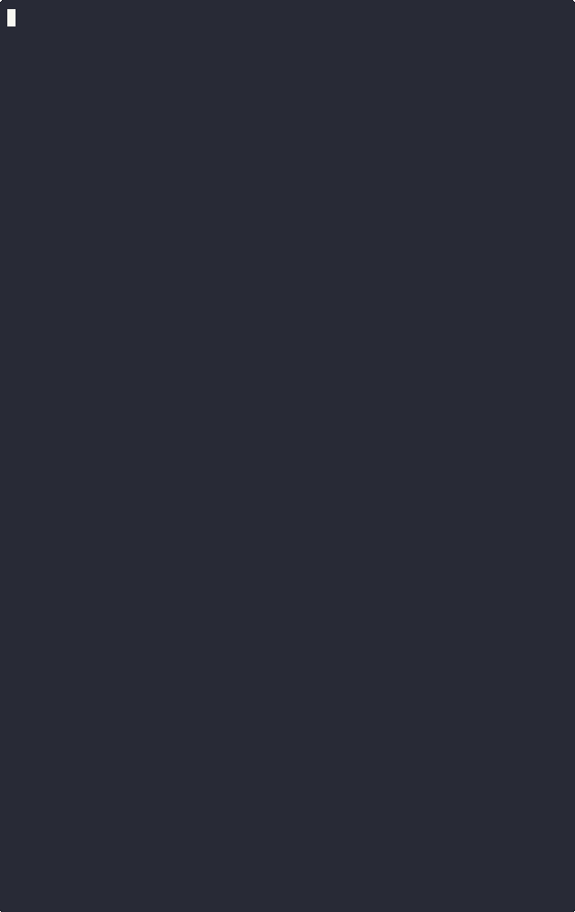

# `latai` Generative AI Latency Measurement TUI

Latai is a Terminal UI application designed to evaluate the performance of Generative AI providers using either default prompts or your own custom inputs.



Latai’s TUI is structured into three distinct views:

1. **Table View** – This is the main interface displaying the list of AI models. Upon startup, `latai` verifies your access keys and loads models from providers that pass the verification. If a key is missing, a notification appears in the **Events** panel.

2. **Information Panel** – This section provides detailed insights into the current run. It’s especially useful when running multiple prompts, as it displays key performance metrics such as jitter, average latency, and min/max latency.

3. **Events Panel** – This panel logs all system activities in real-time. Since `latai` executes performance measurements in parallel without blocking the UI, you can monitor ongoing processes and check for any error messages here.


# Usage

TLDR version (click on links to navigate to documentation sections):
1. [Install](#installation).
2. Check [your keys](#api-keys) in environment.
   * `OPENAI_API_KEY` for OpenAI models.
   * `GROQ_API_KEY` for Groq models.
   * `AWS_PROFILE` for AWS Bedrock
3. Run `latai`.


## Installation

Two installation methods are available.

### Releases

1. **Select a release** from the [Releases Page](https://github.com/pvlbzn/latai/releases) 🔗.
2. **Download the appropriate file** for your platform:
   - **Mac**
   - **Linux**
   - **Windows**
3. If you're unsure which release to download, always get the **latest version**.


### Installing via Go tooling

For this one you need Go and its tooling to be installed.

```shell
# Install
go install github.com/pvlbzn/latai

# Run
latai
```

## API Keys

Latai requires API keys to access LLM providers. Each provider is **optional**—by default, Latai attempts to load all providers and verifies their keys. If a key is missing, the corresponding provider will not be loaded.

If you don’t need a specific provider, simply omit its key.

TLDR:
1. Add the following API keys and values to your environment.
2. Update your terminal environment to apply the changes.

```shell
# OpenAI API key.
export OPENAI_API_KEY=

# Groq API key.
export GROQ_API_KEY=

# AWS Bedrock key. You can specify your AWS profile and region
# here. If you don't do this, yet you have your AWS CLI installed
# Latai will use `default` profile and `us-east-1` region.
export AWS_PROFILE=
export AWS_REGION=
```

> [!IMPORTANT]
> Transparency note. Keys never leave your machine. Latai has no telemetry and does not send your data anywhere. Each provider code has two functions which reach internet. First one is `VerifyAccess` which sends request to list all available models to check API key validity. Second one is `Send` which sends requests to LLMs to measure latency based on default or user prompts.

API key management is provider specific, here are the instructions for each supported provider.

### OpenAI, Groq

OpenAI and Groq use the same API therefore their key management principle is identical. To set keys add these into your environment:

```shell
# OpenAI API key.
export OPENAI_API_KEY=

# Groq API key.
export GROQ_API_KEY=
```

If you don't need Groq, just don't add key.


### AWS Bedrock

AWS uses their own mechanism of authentication which is based on [AWS CLI](https://aws.amazon.com/cli/). Refer to their documentation for details if you need it.

Latai will load your AWS profile in following order:
1. Access `AWS_PROFILE` and `AWS_REGION` from your environment.
2. If not found default to the default values `AWS_PROFILE=default`, `AWS_REGION=us-east-1`.

To set your profile and region add those:

```shell
export AWS_PROFILE=
export AWS_REGION=
```

Make sure that you either load Latai from the same terminal after exports, or add those exports into your shell `rc` file, e.g. `.bashrc`, `.zshrc`, etc.

> [!NOTE]
> Make sure you have access to LLM models from your AWS account. They are not enabled by default. You have to navigate to `https://REGION.console.aws.amazon.com/bedrock/home?region=REGION#/modelaccess` and enable models from the console. Make sure to replace `REGION` with your actual region. [Here is the link](https://us-east-1.console.aws.amazon.com/bedrock/home?region=us-east-1#/modelaccess) for `us-east-1`.

To verify your access you can use `aws` CLI.

```shell
aws bedrock \
  list-foundation-models \
  --region REGION \
  --profile PROFILE
```

Substitute `REGION` and `PROFILE` with your data. You can optionally pipe into `jq` to make output more readable.


## Prompts: Default and Custom

Latai uses a set 3 pre-defined prompts by default. They are just good enough to measure latency to model and back. E.g. `Respond with a single word: "optimistic".`. You can find them [here](https://github.com/pvlbzn/latai/tree/main/internal/prompt/prompts). Three pre-defined prompts meaning that by default all sampling happens with 3 runs.

If you  need to measure compute time, or performance with your particular prompts, then you can add your own into `~/.latai` directory.

```shell
# Create a directory where prompts are stored.
mkdir -p ~/.latai/prompts

# Create your prompts in there.
cd ~/.latai/prompts
touch p1.prompt

# Or create many.
touch {p1, p2, p3, p4, p5}.prompt
```

You can create any number of prompts you wish, just mind throttling and rate limiting. All prompts should have `.prompt` postfix, files with other postfixes will be ignored.


# Providers & Vendors & Models

Definitions:

* A **provider** is a service that grants access to models via an API.
* A **vendor** is the company that owns, develops, trains, and aligns a model.
* A **model** is an LLM with specific properties such as performance, context length, and supported languages.

Providers serve models through APIs. Models can be grouped into families, such as the Claude family. Some providers are **mono-family**, like OpenAI, which uses a single unified API for all its models. Others are **multi-family**, like AWS Bedrock, which has its own API, but the communication format varies depending on the model family.

Vendors may have one or more model families, typically defined by their API. For example, if models A and B share the same API and belong to the same vendor, they are considered part of the same family.

Latai organizes models by provider, as the provider is the core entity that runs the models. However, models can often be available through multiple providers. This distinction creates two API layers:
* The provider API, which handles transport.
* The model API, which defines the data format.


## Rate Limits
Commonly rate limits measured in following metrics:
* RPM: Requests per minute
* RPD: Requests per day
* TPM: Tokens per minute
* TPD: Tokens per day

Verify those with your model provider. This information can be found at provider's documentation. You can find these links below. Keep in mind that these rate limits almost always negotiable with your provider, and generally limits applied to models, not provider itself.

Providers:
* [Groq Rate Limits](https://console.groq.com/docs/rate-limits)
* [OpenAI Rate Limits](https://platform.openai.com/docs/guides/rate-limits)
* AWS Bedrock (read below)


### OpenAI

OpenAI uses tiered rate limits from 1 to 5. For more details consult their documentation.

### AWS Bedrock

AWS Bedrock has multiple providers under their name. Before using most of the models you have to request access to them via AWS UI. 

#### Access

> [!NOTE]
> Make sure you have access to LLM models from your AWS account. They are not enabled by default. You have to navigate to https://REGION.console.aws.amazon.com/bedrock/home?region=REGION#/modelaccess and enable models from the console. Make sure to replace `REGION` with your actual region.

To verify your access you can use `aws` CLI.

```shell
aws bedrock \
  list-foundation-models \
  --region REGION \
  --profile PROFILE
```

Substitute `REGION` and `PROFILE` with your data. You can optionally pipe into `jq` to make output more readable.


#### Models

Even though AWS Bedrock returns lots of models, not all of them can be accessed "as-is". For example AWS Bedrock lists more than 20 Claude-family models, however, only 6 out of them are available without provisioning. Genlat doesn't include models which require special access at the moment.

You can fork this repository and add required provisioned models by adding their ID into `NewBedrock` function [in this file](internal/provider/bedrock.go).


# Contributing

## Adding a New Provider

All providers reside at [provider package](internal/provider). There is one main interface defined at [`provider.go`](internal/provider/provider.go) file.

```go
// Comments omitted for brevity, check source file 
// to see full version.
type Provider interface {
	Name() ModelProvider
	GetLLMModels(filter string) []*Model
	Measure(model *Model, prompt *prompt.Prompt) (*Metric, error)
	Send(message string, to *Model) (*Response, error)
	VerifyAccess() bool
}
```

If a struct satisfies this `Provider` interface it is ready to be used along with all other providers.

If provider you are adding is OpenAI API compliant check [`groq.go`](internal/provider/groq.go) implementation.

Do not forget to add tests. You can see implementation of tests inside of [`provider` package](internal/provider).


# Troubleshooting

## `err` as Latency Value

Read `Events` block of TUI, it generally explains what went wrong. The most common issues is related to AWS Bedrock due to access to models.
